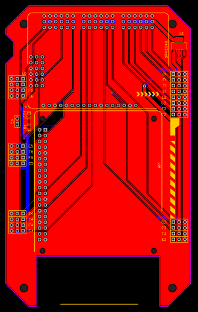
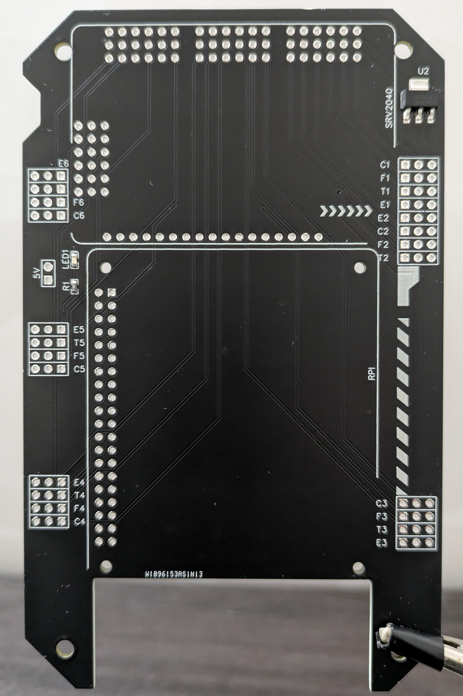

# Hexapod PCB

This repository contains all the files necessary to manufacture and assemble the PCB for my hexapod robot.

For a complete overview of the project, refer to the [main Hexapod repository](https://github.com/ggldnl/Hexapod). Additionally, you may want to check out the repository containing the [Hardware](https://github.com/ggldnl/Hexapod-Hardware).

## 💡 PCBWay

PCB manufacturing and assembly for this project are sponsored by [PCBWay](https://www.pcbway.com/). They handled both the fabrication of the PCB and the SMD assembly.

The boards came back flawless. Build quality was solid and everything was cleanly assembled. 

The whole process — from uploading the design files to receiving the finished boards — was straightforward and didn’t require much back-and-forth. That made it easy to go from design to a working board without friction in the process.

  <table>
    <tr>
      <td></td>
      <td></td>
    </tr>
  </table>

Their service saved me a lot of time and effort, while still being affordable and fast.

They also offer a wide range of other services: standard and advanced PCB manufacturing, assembly, SMD stencil creation, CNC machining and 3D printing to name a few, all with a countless configuration options. If you ever need to turn a design into a physical part, you can just rely on them.

## 📝 Notes

The images refer to a previous version of the PCB. The SMD component on the top right corner (ITS4141NHUMA1) is a power switch intended to cut off the current to the servos in case they stalled (current draw rise above a certain threshold). Unfortunately, I made a mistake and ended up with a component that has a different operating voltage from what the servos expect. This meant the switch wouldn't have worked so I had to scrap the feature. This is entirely my own fault and by no means PCBWay's - in fact, they did an impeccable job with the board.

The current version of the board does NOT have this component. Contributions to improve this part of the schematics are welcome.

The PCB organizes the cables in such a way the ports for the Raspberry and the Servo2040 are easily accessible.

## 🔧 Components

| Component               | Quantity     | Notes                               | TH/SMD      | Optional     |
|-------------------------|--------------|-------------------------------------|-------------|--------------|
| 1x3 male header         | 24           | Connect the motors to the PCB       | TH          | No           |
| 1x3 female header       | 24           | Connect the motor headers on the Servo2040 to the PCB | TH | No  |
| 1x17 female header      | 1            | Connect the Servo2040 GPIOs to the PCB | TH       | No           |
| 2x20 female header      | 1            | Connect the Raspberry to the PCB    | TH          | No           |
| 0603 LED                | 1            | Signal 5V                           | SMD         | YES          |
| 100 ohm 0603 resistor   | 1            | LED                                 | SMD         | YES          |

Approximate cost for PCB manufacturing: around 50€ \
Approximate cost for PCB assembly (only SMD components): around 15€ \
Approximate cost for sourcing TH components: around 10€ (assorted pack of headers on Amazon containing a lot more than what you will need for the build)

## 📝 Notes

1. Some ground connections are not enforced, a DRC check will fail. The problem lies on some ground pins on both the Raspberry and the Servo2040. These are internnally connected so it won't cause any issue.
2. The traces carrying current to the motors should be fine (1.524 mm wide, 1oz, top layer) for the load I expect, but I'll keep an eye on them to check if they overheat.
3. The traces carrying signals from the servo2040 to the pins at the bottom of the PCB are a bit long, but this shouldn't be a problem.

## 🤝 Contribution

Feel free to raise issues or contribute improvements to this repository. For further information about the project, check out the [main Hexapod repository](https://github.com/ggldnl/Hexapod). Give a ⭐️ to this project if you liked the content.
